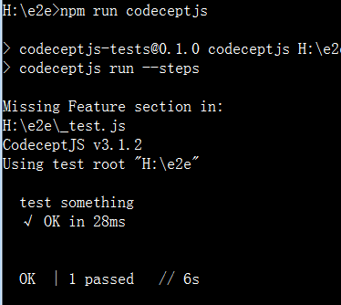

## Codeceptjs

### 一、简介

**CodeceptJS**是开源 MIT 许可的测试框架。适用于您最喜欢的前端框架React, Vue, Angular

### 二、特点

1、场景驱动: 从用户的角度编写验收测试。使测试可读且易于遵循。

2、[驱动无关性](https://codecept.io/basics/#architecture): 执行测试用例在 **Playwright, WebDriver, Puppeteer, TestCafe, Protractor, Appium**时，编写的code是相同的。

3、[交互 Debug](https://codecept.io/basics/#debug):  在测试运行时进行调试。在任何点暂停测试并尝试执行定位器命令。

4、[丰富的定位器](https://codecept.io/locators): 使用语义定位器、CSS、XPath等查找页面上的元素

5、[页面对象（PageObjects）](https://codecept.io/pageobjects/):  PageObjects对于编写稳定和可重用的代码至关重要!

6、[Web和移动端测试:](https://codecept.io/mobile/) 使用Appium或Detox测试原生手机应用。

7、Cucumber-like BDD: 像在CucumberJS中那样自动化业务场景???????

8、[美观的测试报告](https://codecept.io/plugins/#allure): 集成Allure reporter

9、[数据管理](https://codecept.io/data/): 创建假数据并通过REST API清理它

10、[并行测试](https://codecept.io/advanced/#parallel-execution): 测试被分割成块并在多个进程中执行

11、[Reduced Flackiness](https://codecept.io/basics/#retries): 自动重试失败的步骤

12、Multi-Session测试: 使用几个浏览器窗口运行一个测试

### 三、架构

CodeceptJS 通过执行命令到help程序。根据启用的help程序，测试将以不同的方式执行。如果需要跨浏览器支持，您应该选择基于 Selenium 的 WebDriver 或 TestCafé。如果您对速度感兴趣 - 应该使用基于 Chrome 的 Puppeteer。

下面是 CodeceptJS 架构图：


所有help共享相同的 API，因此很容易将测试从一个后端迁移到另一个后端。

但是，由于后端的差异及其限制，不能保证它们彼此兼容。

例如，您不能在 WebDriver 或 Protractor 中设置请求标头，但可以在 Puppeteer 或 Nightmare 中设置。

**选择一个help程序，因为它定义了测试的执行方式。**如果需求发生变化，很容易迁移到另一个。

- [Playwright](https://codecept.io/playwright/)
- [WebDriver](https://codecept.io/webdriver)

* [Puppeteer](https://codecept.io/puppeteer/)
* [Protactor](https://codecept.io/angular/)
* [Nightmare](https://codecept.io/nightmare/)
* [TestCafe](https://codecept.io/testcafe/)

### 四、安装

1.通过安装程序创建一个新项目create-codeceptjs （https://github.com/codeceptjs/create-codeceptjs）

是最简单的开始方式.

第一步：先切换淘宝镜像

```shell
npm config set registry https://registry.npm.taobao.org
```

第二步、安装 CodeceptJS + Puppeteer 到当前目录

```shell
npx create-codeceptjs . --puppeteer
```

第三步：初始化Codeceptjs

```shell
npx codeceptjs init
```


2.标准安装

第一步：创建一个文件夹，并进行初始化

```shell
npm init -y
```

第二步：安装Codeceptjs

```shell
npm install codeceptjs puppeteer --save-dev
```

第三步：初始化Codeceptjs

```shell
npx codeceptjs init
```

第四步：运行codeceptjs

```
npm run codeceptjs
```



### 五、入门

CodeceptJS 是一个现代的端到端测试框架，具有特殊的 BDD（**行为驱动开发**） 风格的语法。测试被编写为用户在站点上的操作的线性场景。

1）编写测试

```js
Feature('CodeceptJS demo');

Scenario('check Welcome page on site', ({ I }) => {
  //当 URL 不以协议（http:// 或 https://）开头时，
  //它被认为是一个相对 URL，并将附加到最初在配置中设置的 URL
  I.amOnPage('https://google.com');
  I.amOnPage('/');
  I.see('Welcome');
});
```

测试预计将使用**ECMAScript 7**编写。

每个测试都在一个`Scenario`函数中描述，`I`对象传递给它。该`I`对象是一个**actor**，一个测试用户的抽象。该`I`是目前启用了代理对象**助手（helper）**

2.运行测试

要启动测试使用的`run`命令，以执行测试[多个浏览器](https://codecept.io/advanced/#multiple-browsers-execution)或[多个线程](https://codecept.io/advanced/#parallel-execution)使用的`run-multiple`命令

3.详细程度

要查看运行测试的分步输出，请添加`--steps`标志：

```shell
npx codeceptjs run --steps
```

要查看更详细的输出，请添加`--debug`标志：

```
npx codeceptjs run --debug
```

要查看非常详细的输出信息，请使用以下`--verbose`标志：

```
npx codeceptjs run --verbose
```

4.Filter

如果您提供此类文件的相对路径，则可以执行单个测试文件

```shell
npx codeceptjs run github_test.js

# or

npx codeceptjs run admin/login_test.js
```

要按名称过滤测试，请使用`--grep`参数，它将执行名称与正则表达式模式匹配的所有测试。

要运行包含`slow`单词的所有测试：

```shell
npx codeceptjs run --grep "slow"
```

5.并行运行?

从 CodeceptJS 2.3 开始，您可以使用 NodeJS 工作线程并行运行测试。此功能需要 NodeJS >= 11.6。使用`run-workers`带有工人（线程）数量的命令来拆分测试。

```
npx codeceptjs run-workers 3
```

测试按场景拆分，而不是按文件拆分。结果汇总并显示在主流程中。

### 六、配置

#### （1）codecept配置

CodeceptJS配置在**codecept.conf.js**文件中设置。

执行 `npx codeceptjs init`应该保存在测试根目录中。在配置文件中，可以启用和配置`helper`和插件，并设置引导和拆卸脚本

完整配置参考（https://codecept.io/configuration/）

以下是可用选项及其默认值:

| option      | 默认值           | 描述                                                         |
| ----------- | ---------------- | ------------------------------------------------------------ |
| tests       | "./*_test.js"    | 模式定位测试。允许输入[glob模式](https://github.com/isaacs/node-glob)，可以是单个文件测试，也可以是一组测试 |
| grep        |                  | 按名称过滤测试                                               |
| include     | {}               | 要在DI容器中注册并包含在测试中的actor和page object。         |
| timeout     | 1000             | 测试默认的timeout时间                                        |
| output      | "./output"       | 存储失败截图的目录                                           |
| helpers     | {}               | 启用的helper列表                                             |
| mocha       | {}               | https://codecept.io/reports/#xml                             |
| multiple    | {}               | [Multiple Execution](https://codecept.io/parallel#multiple-browsers-execution) |
| bootstrap   | "./bootstrap.js" |                                                              |
| teardown    |                  |                                                              |
| noGlobals   | false            | 禁止注册全局变量，如Actor`, `Helper`, `pause`, `within`, `DataTable |
| hooks       |                  | 包括插入到执行工作流中的自定义侦听器                         |
| translation |                  | 区域设置用于打印步骤输出，以及在源代码中使用。               |
| require     | []               | 在codecept开始之前需要的模块名称数组。https://codecept.io/configuration/#require |

#### （2）Puppeteer配置

puppeteer help 配置： https://codecept.io/helpers/Puppeteer/#configuration

Extends Helper

| name                  | description                                                  |
| --------------------- | ------------------------------------------------------------ |
| url                   | 待测试网站的base url                                         |
| basicAuth             | 传递给base url的基本身份验证                                 |
| show                  | 显示调试谷歌Chrome窗口。                                     |
| restart               | 在测试之间重新启动浏览器                                     |
| disableScreenshots    | 失败时不要保存截图                                           |
| fullPageScreenshots   | 对失败进行完整的页面截图                                     |
| uniqueScreenshotNames | 选项，以防止屏幕截图覆盖，比如有不同套件中的相同名称的场景   |
| keepBrowserState      | 当restart设置为false时，在测试之间保持浏览器状态             |
| keepCookies           | 当restart设置为false时，在测试之间保持cookie                 |
| waitForAction         | 在点击、双击或按下键后等待多长时间，以毫秒为单位。默认为100ms |
| waitForNavigation     | 何时考虑导航成功。可能的选项:load,domcontentloaded, networkidle0, networkidle2,参见[Puppeteer AP](https://github.com/puppeteer/puppeteer/blob/main/docs/api.md#pagewaitfornavigationoptions)I。数组值也可以接受。 |
| pressKeyDelay         | 在ms中按键之间的延迟。在fillField/appendField中调用Puppeteers时使用 |
| getPageTimeout        | 选项设置最大导航时间(以毫秒为单位)。如果timeout设置为0，那么timeout将被禁用 |
| waitForTimeout        | 默认等待*超时毫秒。默认值:1000。                             |
| windowSize            | 默认的窗口大小。默认设置尺寸为640x480                        |
| userAgent             | user-agent string.                                           |
| manualStart           | 不要在测试前启动浏览器，在helper中使用this.helpers["Puppeteer"]. _startbrowser()手动启动浏览器。 |
| browser               | 可以在使用[puppeteer-firefox](https://codecept.io/helpers/Puppeteer-firefox)时更改为firefox(打开新窗口)。 |
| chrome                | 传递额外的[puppeteer运行选项](https://github.com/puppeteer/puppeteer/blob/main/docs/api.md#puppeteerlaunchoptions) |


```js
exports.config = {
  helpers: {
    // enabled helpers with their configs
  },
  plugins: {
    // list of used plugins
  },
  include: {
    // current actor and page objects
  }
}
```

同一个项目可以有多个配置文件，在这种情况下，您可以指定一个`-c`在运行时使用的配置文件。

```shell
npx codeceptjs run -c codecept.ci.conf.js
```

调整 WebDriver、Puppeteer 等助手的配置可能很困难，因为它需要对这些技术的工作原理有很好的了解。使用[`@codeceptjs/configure` ](https://github.com/codeceptjs/configure)带有常见配置配方的包。

例如，您可以设置窗口大小或切换无头模式，无论实际使用哪个助手。

```js
const { setHeadlessWhen, setWindowSize } = require('@codeceptjs/configure');

// run headless when CI environment variable set
setHeadlessWhen(process.env.CI);
// set window size for any helper: Puppeteer, WebDriver, TestCafe
setWindowSize(1600, 1200);

exports.config = {
  // ...
}
```

查看更多配置（https://github.com/codeceptjs/configure）

### 七、调试

CodeceptJS 允许在保持浏览器打开的同时即时编写和调试测试。通过使用交互式 shell，您可以随时停止执行并输入任何 CodeceptJS 命令。

打开页面调用`pause()`后开始与页面交互

```js
I.amOnPage('/');
pause();
```

#### 1.暂停

可以通过`pause()`调用在测试的任何地方暂停测试执行。还可以将变量传递给`pause({data: 'hi', func: () => console.log('hello')})`可在交互式 shell 中访问的变量。

这将启动交互式控制台，您可以在其中调用`I`对象的任何操作。

```shell
Interactive shell started
 Press ENTER to resume test
 Use JavaScript syntax to try steps in action
 - Press ENTER to run the next step
 - Press TAB twice to see all available commands
 - Type exit + Enter to exit the interactive shell
 - Prefix => to run js commands
 I.
```

输入不同的动作来尝试它们，将成功的动作复制并粘贴到测试文件中。

按`ENTER`恢复测试执行。

要**逐步调试测试，请**按 Enter，将执行下一步并再次显示交互式 shell。

要查看所有可用命令，请按两次 TAB 以查看`I`对象中包含的所有操作的列表。

```shell
I.=> func()
I.=> func2()
I.=> 2 + 5
```

#### 2.失败时暂停

```shell
npx codeceptjs run -p pauseOnFail
```

#### 3.失败截图

默认情况下，CodeceptJS 保存失败测试的屏幕截图。这可以在[screenshotOnFail 插件中](https://codecept.io/plugins/#screenshotonfail)配置，新设置**默认启用**[screenshotOnFail 插件](https://codecept.io/plugins/#screenshotonfail)

要在没有插件的情况下在测试后暂停，可以在测试文件中使用`After(pause)`。

#### 4.分步报告

要查看测试是如何执行的，请使用[stepByStepReport Plugin](https://codecept.io/plugins/#stepbystepreport)。它保存了每个通过步骤的屏幕截图，并以漂亮的幻灯片显示它们。

？？？？？？？？？？？？？？？？？？？？？？

### 八、重试

#### 1.自动重试

您可以通过启用[retryFailedStep Plugin](https://codecept.io/plugins/#retryfailedstep)来**自动重试**失败的步骤。新设置**默认启用**[retryFailedStep 插件](https://codecept.io/plugins/#retryfailedstep)

#### 2.重试步骤

除非您使用 retryFailedStep 插件，否则您可以手动控制项目中的重试。

如果您有一个经常失败的步骤，您可以重试执行这一步。`retry()`在操作之前使用该函数要求 CodeceptJS 在失败时重试：

```js
I.retry().see('Welcome');
```

如果您想多次重试一个步骤，请将重试的次数作为参数

可以向 提供附加选项`retry`，因此您可以设置其他附加选项（在[promise-retry 中](https://www.npmjs.com/package/promise-retry)定义）。

```js
I.retry(3).see('Welcome');

// retry action 3 times waiting for 0.1 second before next try
I.retry({ retries: 3, minTimeout: 100 }).see('Hello');

// retry action 3 times waiting no more than 3 seconds for last retry
I.retry({ retries: 3, maxTimeout: 3000 }).see('Hello');

// retry 2 times if error with message 'Node not visible' happens
I.retry({
  retries: 2,
  when: err => err.message === 'Node not visible'
}).seeElement('#user');
```

将函数传递给`when`选项，仅在错误信息与预期匹配时**重试**

#### 3.重试Scenario

当您需要多次重新运行场景时，请将该`retries`选项添加到`Scenario`声明中。

```
Scenario('Really complex', ({ I }) => {
  // test goes here
}).retry(2);

// alternative
Scenario('Really complex', { retries: 2 },({ I }) => {});
```

此场景将在失败时重新启动两次。与重试步骤不同，**`when`场景级别不支持重试条件**

#### 4.重试Feature？？？？？？？？？？？？

要为文件中的所有场景设置此选项，请添加`retry`到Feature：

```js
Feature('Complex JS Stuff').retry(3);
```

此功能中的每个场景都将重新运行 3 次。通过将`retries`选项传递给场景来对特定场景进行异常处理。

### 九、Before

常见的准备步骤，如打开网页或登录用户，可以放在`Before`或`Background`钩子中：

```js
Feature('CodeceptJS Demonstration');

Before(({ I }) => { // or Background
  I.amOnPage('/documentation');
});

Scenario('test some forms', ({ I }) => {
  I.click('Create User');
  I.see('User is valid');
  I.dontSeeInCurrentUrl('/documentation');
});

Scenario('test title', ({ I }) => {
  I.seeInTitle('Example application');
});
```

与`Before`一样，您可以使用`After`为每个场景运行拆卸

### 十、BeforeSuite

如果您需要在所有测试之前运行复杂的设置并且必须在之后拆除它，您可以使用`BeforeSuite`和`AfterSuite`函数，

>注意：
>
>`BeforeSuite`并且`AfterSuite`可以访问该`I`对象，但`BeforeSuite/AfterSuite`不能访问浏览器，因为此时它没有运行。您可以使用它们来执行将设置您的环境的处理程序。`BeforeSuite/AfterSuite`仅适用于它在其中声明的文件（因此您可以为文件声明不同的设置）

```javascript
BeforeSuite(({ I }) => {
  I.syncDown('testfolder');
});

AfterSuite(({ I }) => {
  I.syncUp('testfolder');
  I.clearDir('testfolder');
});
```

[这里有一些想法 ](https://github.com/codeceptjs/CodeceptJS/pull/231#issuecomment-249554933)关于在哪里使用 BeforeSuite 钩子。

### 十一、Within

要指定页面上可以执行操作的确切区域，您可以使用该`within`功能。在其上下文中执行的所有内容都将缩小到定位器指定的上下文

```javascript
I.amOnPage('https://github.com');

within('.js-signup-form', () => {
  I.fillField('user[login]', 'User');
  I.fillField('user[email]', 'user@user.com');
  I.fillField('user[password]', 'user@user.com');
  I.click('button');
});

I.see('There were problems creating your account.');
```

> 注意：如果使用不当，内部可能会导致问题。如果您看到一个测试的奇怪行为，尝试重构它，使其不在内部使用。在可能的情况下，建议保持在最简单的范围内。由于within返回Promise，所以即使不打算使用返回值，也可能需要等待结果。

within也可以与IFrames一起工作。需要一个特殊的`frame locator `来定位iframe进入它的上下文中。

```javascript
within({frame: "#editor"}, () => {
  I.see('Page');
});
```

Within可以返回一个值，可以在以下场景中使用:

```javascript
// inside async function
const val = await within('#sidebar', () => {
  return I.grabTextFrom({ css: 'h1' });
});

I.fillField('Description', val);
```

### 十二、Conditional Actions

有一种方法可以在不使测试失败的情况下执行不成功的操作。当您可能需要单击“accept cookie”按钮但可能 cookie 已被点击时，这可能很有用。为了处理这些情况`tryTo`，引入了函数：

```javascript
tryTo(() => I.click('Accept', '.cookies'));
```

当你在页面上处理不确定性的情况时，你也可以使用tryTo， `tryTo`功能默认通过[tryTo 插件](https://codecept.io/plugins/#tryto)启用

### 十三、注释

有一种简单的方法可以向您的测试场景添加附加注释：使用`say`命令将信息打印到屏幕：

```js
I.say('I am going to publish post');
I.say('I enter title and body');
I.say('I expect post is visible on site');
```

使用第二个参数传递颜色值 (ASCII)。

```js
I.say('This is red', 'red'); //red is used
I.say('This is blue', 'blue'); //blue is used
I.say('This is by default'); //cyan is used
```

### 十四、Multiple Sessions

CodeceptJS 允许在一个测试中运行多个浏览器会话。这对于测试聊天或其他系统内的用户之间的通信非常有用。要打开另一个浏览器，请使用`session()`示例中所示的函数：

```js
Scenario('test app', ({ I }) => {
  I.amOnPage('/chat');
  I.fillField('name', 'davert');
  I.click('Sign In');
  I.see('Hello, davert');
  session('john', () => {
    // another session started
    I.amOnPage('/chat');
    I.fillField('name', 'john');
    I.click('Sign In');
    I.see('Hello, john');
  });
  // switching back to default session
  I.fillField('message', 'Hi, john');
  // there is a message from current user
  I.see('me: Hi, john', '.messages');
  session('john', () => {
    // let's check if john received it
    I.see('davert: Hi, john', '.messages');
  });
});
```

该`session`函数期望第一个参数是会话的名称。您可以**使用相同的名称切换回此会话**。

您可以通过传递第二个参数来覆盖会话的配置：

```js
session('john', { browser: 'firefox' } , () => {
  // run this steps in firefox
  I.amOnPage('/');
});
```

或者只是启动会话而不切换到它。调用`session`仅传递其名称：

```js
Scenario('test', ({ I }) => {
  // opens 3 additional browsers
  session('john');
  session('mary');
  session('jane');

  I.amOnPage('/');

  // switch to session by its name
  session('mary', () => {
    I.amOnPage('/login');
  });
}
```

`session` 可以返回一个可以在场景中使用的值：

```js
// inside async function
const val = await session('john', () => {
  I.amOnPage('/info');
  return I.grabTextFrom({ css: 'h1' });
});
I.fillField('Description', val);
```

传入session的函数可以使用**I object**, **page object** 和为场景声明的**任何其他对象**

此外，您可以在 session 内使用within，但不能在 within内调用 session 

### 十四、Skipping

您可以使用`x`和`only`跳过测试或运行单个测试。

* `xScenario` - 跳过当前测试
* `Scenario.skip` - 跳过当前测试
* `Scenario.only` - 只执行当前测试
* `xFeature` - 跳过当前套件 **从 2.6.6 开始**
* `Feature.skip` - 跳过当前套件 **从 2.6.6 开始**

### 十五、Todo Test

可以在计划编写测试时使用`Scenario.todo`。

将像常规测试一样跳过此测试，`Scenario.skip`但会显示附加消息“测试未实现！”：

将其与测试主体一起用作测试计划：

```js
Scenario.todo('Test',  I => {
/**
 * 1. Click to field
 * 2. Fill field
 *
 * Result:
 * 3. Field contains text
 */
});
```

甚至没有测试机构：

```js
Scenario.todo('Test');
```

## CodeceptUI

CodeceptJS 有一个交互式的、图形化的测试运行器。我们称之为 CodeceptUI。它适用于您的浏览器并帮助您管理测试。

CodeceptUI 可用于

- 按组或单个运行测试
- 获取测试报告
- review tests
- 编辑tests and page objects
- write new tests
- 在多个测试运行中重用一个浏览器会话
- 轻松切换到无头/有头模式

### 安装

CodeceptUI 已经通过`create-codeceptjs`命令安装，但您可以通过以下方式手动安装：

```shell
npm i @codeceptjs/ui --save
```

### 用法

要开始使用 CodeceptUI，您需要有 CodeceptJS 项目并编写了一些测试。如果 CodeceptUI 是通过`create-codecept`命令安装的，它可以通过以下方式启动：

```shell
npm run codeceptjs:ui
```

CodeceptUI 可以在两种模式下启动：

- **应用程序**模式 - 在窗口中启动 Electron 应用程序。专为桌面系统设计。
- **服务器**模式 - 启动网络服务器。专为 CI 系统设计。

在应用程序模式下启动 CodeceptUI：

```shell
npx codecept-ui --app
```

在服务器模式下启动 CodeceptUI：

```shell
npx codecept-ui
```

