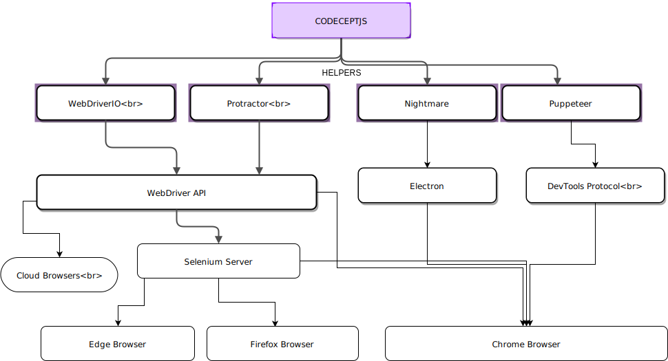
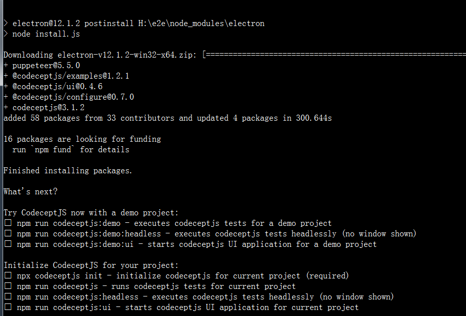

## Codeceptjs

### 一、简介

**CodeceptJS**是开源 MIT 许可的测试框架。适用于您最喜欢的前端框架React, Vue, Angular

### 二、特点

1、场景驱动: 从用户的角度编写验收测试。使测试可读且易于遵循。

2、[驱动无关性](https://codecept.io/basics/#architecture): 执行测试用例在 **Playwright, WebDriver, Puppeteer, TestCafe, Protractor, Appium**时，编写的code是相同的。

3、[交互 Debug](https://codecept.io/basics/#debug):  在测试运行时进行调试。在任何点暂停测试并尝试执行定位器命令。

4、[丰富的定位器](https://codecept.io/locators): 使用语义定位器、CSS、XPath等查找页面上的元素

5、[页面对象（PageObjects）](https://codecept.io/pageobjects/):  PageObjects对于编写稳定和可重用的代码至关重要!

6、[Web和移动端测试:](https://codecept.io/mobile/) 使用Appium或Detox测试原生手机应用。

7、Cucumber-like BDD: 像在CucumberJS中那样自动化业务场景

8、[美观的测试报告](https://codecept.io/plugins/#allure): 集成Allure reporter

9、[数据管理](https://codecept.io/data/): 创建假数据并通过REST API清理它

10、[并行测试](https://codecept.io/advanced/#parallel-execution): 测试被分割成块并在多个进程中执行

11、[Reduced Flackiness](https://codecept.io/basics/#retries): 自动重试失败的步骤

12、Multi-Session测试: 使用几个浏览器窗口运行一个测试

### 三、架构

CodeceptJS 通过执行命令到help程序。根据启用的help程序，测试将以不同的方式执行。如果需要跨浏览器支持，您应该选择基于 Selenium 的 WebDriver 或 TestCafé。如果您对速度感兴趣 - 应该使用基于 Chrome 的 Puppeteer。

下面是 CodeceptJS 架构图：




所有help共享相同的 API，因此很容易将测试从一个后端迁移到另一个后端。

但是，由于后端的差异及其限制，不能保证它们彼此兼容。

例如，您不能在 WebDriver 或 Protractor 中设置请求标头，但可以在 Puppeteer 或 Nightmare 中设置。

**选择一个help程序，因为它定义了测试的执行方式。**如果需求发生变化，很容易迁移到另一个。

- [Playwright](https://codecept.io/playwright/)
- [WebDriver](https://codecept.io/webdriver)

* [Puppeteer](https://codecept.io/puppeteer/)
* [Protactor](https://codecept.io/angular/)
* [Nightmare](https://codecept.io/nightmare/)
* [TestCafe](https://codecept.io/testcafe/)

### 四、安装

1.通过安装程序创建一个新项目create-codeceptjs （https://github.com/codeceptjs/create-codeceptjs）

是最简单的开始方式.

第一步：先切换淘宝镜像

```shell
npm config set registry https://registry.npm.taobao.org
```

第二步、安装 CodeceptJS + Puppeteer 到当前目录

```shell
npx create-codeceptjs . --puppeteer
```

第三步：初始化Codeceptjs

```shell
npx codeceptjs init
```




2.标准安装

第一步：创建一个文件夹，并进行初始化

```shell
npm init -y
```

第二步：安装Codeceptjs

```shell
npm install codeceptjs puppeteer --save-dev
```

第三步：初始化Codeceptjs

```shell
npx codeceptjs init
```

第四步：运行codeceptjs

```
npm run codeceptjs
```


### 五、入门

CodeceptJS 是一个现代的端到端测试框架，具有特殊的 BDD（**行为驱动开发**） 风格的语法。测试被编写为用户在站点上的操作的线性场景。

1）编写测试

```js
Feature('CodeceptJS demo');

Scenario('check Welcome page on site', ({ I }) => {
  //当 URL 不以协议（http:// 或 https://）开头时，
  //它被认为是一个相对 URL，并将附加到最初在配置中设置的 URL
  I.amOnPage('https://google.com');
  I.amOnPage('/');
  I.see('Welcome');
});
```

测试使用**ECMAScript 7**编写。

每个测试都在一个`Scenario`函数中描述，`I`对象传递给它。该`I`对象是一个**actor**，一个测试用户的抽象。该`I`指的是目前启用的**助手（helper）**

2.并行运行测试

>CodeceptJS有两个并行运行测试的引擎:
>
>`run-workers`: 在线程中生成NodeJS Worker。测试按场景划分，场景在组之间混合，每个工作人员从自己的组运行测试。
>
>`run-multiple`: 用CodeceptJS生成一个子进程。测试由文件分割，并在codecept.conf.js中配置。

3.运行测试

要查看运行测试的分步输出，请添加`--steps`标志：

```shell
npx codeceptjs run --steps
```

要查看更详细的输出，请添加`--debug`标志：

```
npx codeceptjs run --debug
```

要查看非常详细的输出信息，请使用以下`--verbose`标志：

```
npx codeceptjs run --verbose
```

4.Filter

如果您提供此类文件的相对路径，则可以执行单个测试文件

```shell
npx codeceptjs run slow_test.js

# or

npx codeceptjs run demo/slow_test.js
```

```shell
E:\codeceptjsDemo>npx codeceptjs run demo/slow_test.js
CodeceptJS v3.1.2
Using test root "E:\codeceptjsDemo"

Slow Test --
  √ test slow in 4175ms

  OK  | 1 passed   // 8s
```

要按名称过滤测试，请使用`--grep`参数，它将执行名称与正则表达式模式匹配的所有测试。

要运行包含`slow`单词的所有测试：

```shell
npx codeceptjs run --grep "slow"
```

```shell
F:\Java\repositories\codeceptjsDemo>npx codeceptjs run --grep "slow"
CodeceptJS v3.1.2
Using test root "E:\codeceptjsDemo"

Slow Test --
  √ test slow in 5722ms

  OK  | 1 passed   // 14s
```

5.并行运行

从 CodeceptJS 2.3 开始，您可以使用 NodeJS 工作线程并行运行测试。此功能需要 NodeJS >= 11.6。使用`run-workers`带有工人（线程）数量的命令来拆分测试。

```
npx codeceptjs run-workers 3
```

测试按场景拆分，而不是按文件拆分。结果汇总并显示在主流程中。

```shell
F:\Java\repositories\codeceptjsDemo>npx codeceptjs run-workers 3
CodeceptJS v3.1.2
Running tests in 3 workers...

[02]   √ test something in 2095ms
[01]   √ search codeceptjs in 5957ms
[03]   √ test github in 8450ms
[01]   √ test hello in 10ms

  OK  | 4 passed   // 29s

```


### 六、配置

#### （1）codecept配置

CodeceptJS配置在**codecept.conf.js**文件中设置。

执行 `npx codeceptjs init`应该保存在测试根目录中。在配置文件中，可以启用和配置`helper`和插件，并设置引导和拆卸脚本

完整配置参考（https://codecept.io/configuration/）

以下是可用选项及其默认值:

| option      | 描述                                                         |
| ----------- | ------------------------------------------------------------ |
| tests       | `"./*_test.js"`, 模式定位测试。允许输入[glob模式](https://github.com/isaacs/node-glob)，可以是用于定位测试的模式，也可以是用于定位测试/测试文件名的模式数组 |
| grep        | 按名称过滤测试                                               |
| include     | 要在DI容器中注册并包含在测试中的actor和page object。         |
| timeout     | 测试默认的timeout时间                                        |
| output      | "./output", 存储失败截图的目录等等                           |
| helpers     | 启用的helper列表                                             |
| mocha       | https://codecept.io/reports/#xml, reporters可以在这里配置    |
| multiple    | [Multiple Execution ](https://codecept.io/parallel#multiple-browsers-execution) |
| bootstrap   | "./bootstrap.js", 在运行测试之前运行代码的选项               |
| teardown    | 使用run-multiple模式时，在运行所有测试套件之后运行代码的选项 |
| noGlobals   | 禁止注册全局变量，如Actor`, `Helper`, `pause`, `within`, `DataTable |
| hooks       | 包括插入到执行工作流中的自定义侦听器                         |
| translation | 测试输出和编写测试的方式可以本地化                           |
| require     | 在codecept开始之前需要的模块名称数组。https://codecept.io/configuration/#require |

#### （2）Puppeteer配置

puppeteer help 配置： https://codecept.io/helpers/Puppeteer/#configuration

Extends Helper

| name                  | description                                                  |
| --------------------- | ------------------------------------------------------------ |
| url                   | 待测试网站的base url                                         |
| basicAuth             | 传递给base url的基本身份验证                                 |
| show                  | 显示调试谷歌Chrome窗口。                                     |
| restart               | 在测试之间重新启动浏览器                                     |
| disableScreenshots    | 失败时不要保存截图                                           |
| fullPageScreenshots   | 对失败进行完整的页面截图                                     |
| uniqueScreenshotNames | 选项，以防止屏幕截图覆盖，比如有不同套件中的相同名称的场景   |
| keepBrowserState      | 当restart设置为false时，在测试之间保持浏览器状态             |
| keepCookies           | 当restart设置为false时，在测试之间保持cookie                 |
| waitForAction         | 在点击、双击或按下键后等待多长时间，以毫秒为单位。默认为100ms |
| waitForNavigation     | 何时考虑导航成功。可能的选项:load,domcontentloaded, networkidle0, networkidle2,参见[Puppeteer AP](https://github.com/puppeteer/puppeteer/blob/main/docs/api.md#pagewaitfornavigationoptions)I。数组值也可以接受。 |
| pressKeyDelay         | 在ms中按键之间的延迟。在fillField/appendField中调用Puppeteers时使用 |
| getPageTimeout        | 选项设置最大导航时间(以毫秒为单位)。如果timeout设置为0，那么timeout将被禁用 |
| waitForTimeout        | 默认等待*超时毫秒。默认值:1000。                             |
| windowSize            | 默认的窗口大小。默认设置尺寸为640x480                        |
| userAgent             | user-agent string.                                           |
| manualStart           | 不要在测试前启动浏览器，在helper中使用this.helpers["Puppeteer"]. _startbrowser()手动启动浏览器。 |
| browser               | 可以在使用[puppeteer-firefox](https://codecept.io/helpers/Puppeteer-firefox)时更改为firefox。 |
| chrome                | 传递额外的[puppeteer运行选项](https://github.com/puppeteer/puppeteer/blob/main/docs/api.md#puppeteerlaunchoptions) |


```js
exports.config = {
  helpers: {
    // enabled helpers with their configs
  },
  plugins: {
    // list of used plugins
  },
  include: {
    // current actor and page objects
  }
}
```

同一个项目可以有多个配置文件，在这种情况下，您可以指定一个`-c`在运行时使用的配置文件。

```shell
npx codeceptjs run -c codecept.conf.js
```

调整 WebDriver、Puppeteer 等助手的配置可能很困难，因为它需要对这些技术的工作原理有很好的了解。使用[`@codeceptjs/configure` ](https://github.com/codeceptjs/configure)带有常见配置配方的包。

例如，您可以设置窗口大小或切换无头模式，无论实际使用哪个助手。

```js
const { setHeadlessWhen, setWindowSize } = require('@codeceptjs/configure');

// run headless when CI environment variable set
setHeadlessWhen(process.env.CI);
// set window size for any helper: Puppeteer, WebDriver, TestCafe
setWindowSize(1600, 1200);

exports.config = {
  // ...
}
```

查看更多配置（https://github.com/codeceptjs/configure）

### 七、调试

CodeceptJS 允许在保持浏览器打开的同时即时编写和调试测试。通过使用交互式 shell，您可以随时停止执行并输入任何 CodeceptJS 命令。

打开页面调用`pause()`后开始与页面交互

```js
I.amOnPage('/');
pause();
```

#### 1.暂停

可以通过`pause()`调用在测试的任何地方暂停测试执行。还可以将变量传递给`pause({data: 'hi', func: () => console.log('hello')})`可在交互式 shell 中访问的变量。

这将启动交互式控制台，您可以在其中调用`I`对象的任何操作。

```shell
Interactive shell started
 Press ENTER to resume test
 Use JavaScript syntax to try steps in action
 - Press ENTER to run the next step
 - Press TAB twice to see all available commands
 - Type exit + Enter to exit the interactive shell
 - Prefix => to run js commands
 I.
```

输入不同的动作来尝试它们，将成功的动作复制并粘贴到测试文件中。按`ENTER`恢复测试执行。

要**逐步调试测试，请**按 Enter，将执行下一步并再次显示交互式 shell。

要查看所有可用命令，请按两次 TAB 以查看`I`对象中包含的所有操作的列表。

```shell
I.=> func()
I.=> func2()
I.=> 2 + 5
```

#### 2.失败时暂停

```shell
npx codeceptjs run -p pauseOnFail
```

#### 3.失败截图

默认情况下，CodeceptJS 保存失败测试的屏幕截图。这可以在[screenshotOnFail 插件中](https://codecept.io/plugins/#screenshotonfail)配置，新设置**默认启用**[screenshotOnFail 插件](https://codecept.io/plugins/#screenshotonfail)

要在没有插件的情况下在测试后暂停，可以在测试文件中使用`After(pause)`。

#### 4.分步报告

要查看测试是如何执行的，请使用[stepByStepReport Plugin](https://codecept.io/plugins/#stepbystepreport)。它保存了每个通过步骤的屏幕截图，并以漂亮的幻灯片显示它们。

？？？？？？？？？？？？？？？？？？？？？？

### 八、重试

#### 1.自动重试

您可以通过启用[retryFailedStep Plugin](https://codecept.io/plugins/#retryfailedstep)来**自动重试**失败的步骤。新设置**默认启用**[retryFailedStep 插件](https://codecept.io/plugins/#retryfailedstep)

#### 2.重试步骤

除非您使用 retryFailedStep 插件，否则您可以手动控制项目中的重试。

如果您有一个经常失败的步骤，您可以重试执行这一步。`retry()`在操作之前使用该函数要求 CodeceptJS 在失败时重试：

```js
I.retry().see('Welcome');
```

如果您想多次重试一个步骤，请将重试的次数作为参数

可以向 提供附加选项`retry`，因此您可以设置其他附加选项（在[promise-retry 中](https://www.npmjs.com/package/promise-retry)定义）。

```js
I.retry(3).see('Welcome');

// retry action 3 times waiting for 0.1 second before next try
I.retry({ retries: 3, minTimeout: 100 }).see('Hello');

// retry action 3 times waiting no more than 3 seconds for last retry
I.retry({ retries: 3, maxTimeout: 3000 }).see('Hello');

// retry 2 times if error with message 'Node not visible' happens
I.retry({
  retries: 2,
  when: err => err.message === 'Node not visible'
}).seeElement('#user');
```

将函数传递给`when`选项，仅在错误信息与预期匹配时**重试**

#### 3.重试Scenario

当您需要多次重新运行场景时，请将该`retries`选项添加到`Scenario`声明中。

```
Scenario('Really complex', ({ I }) => {
  // test goes here
}).retry(2);

// alternative
Scenario('Really complex', { retries: 2 },({ I }) => {});
```

此场景将在失败时重新启动两次。与重试步骤不同，**`when`场景级别不支持重试条件**

#### 4.重试Feature

要为文件中的所有场景设置此选项，请添加`retry`到Feature：

```js
Feature('Complex JS Stuff').retry(3);
```

此功能中的每个场景都将重新运行 3 次。通过将`retries`选项传递给场景来对特定场景进行异常处理。

### 九、Before

常见的准备步骤，如打开网页或登录用户，可以放在`Before`或`Background`钩子中：

```js
Feature('CodeceptJS Demonstration');

Before(({ I }) => { // or Background
  I.amOnPage('/documentation');
});

Scenario('test some forms', ({ I }) => {
  I.click('Create User');
  I.see('User is valid');
  I.dontSeeInCurrentUrl('/documentation');
});

Scenario('test title', ({ I }) => {
  I.seeInTitle('Example application');
});
```

与`Before`一样，您可以使用`After`为每个场景运行拆卸

### 十、BeforeSuite

如果您需要在所有测试之前运行复杂的设置并且必须在之后拆除它，您可以使用`BeforeSuite`和`AfterSuite`函数，

>注意：
>
>`BeforeSuite`和`AfterSuite`可以访问该`I`对象，但`BeforeSuite/AfterSuite`不能访问浏览器，因为此时它没有运行。您可以使用它们来执行将设置您的环境的处理程序。`BeforeSuite/AfterSuite`仅适用于在其中声明的文件（因此您可以为文件声明不同的设置）

```javascript
BeforeSuite(({ I }) => {
  I.syncDown('testfolder');
});

AfterSuite(({ I }) => {
  I.syncUp('testfolder');
  I.clearDir('testfolder');
});
```

[这里有一些想法 ](https://github.com/codeceptjs/CodeceptJS/pull/231#issuecomment-249554933)关于在哪里使用 BeforeSuite 钩子。

### 十一、Within

要指定页面上可以执行操作的确切区域，您可以使用该`within`功能。在其上下文中执行的所有内容都将缩小到定位器指定的上下文

```javascript
I.amOnPage('https://github.com');

within('.js-signup-form', () => {
  I.fillField('user[login]', 'User');
  I.fillField('user[email]', 'user@user.com');
  I.fillField('user[password]', 'user@user.com');
  I.click('button');
});

I.see('There were problems creating your account.');
```

> 注意：如果使用不当，内部可能会导致问题。如果您看到一个测试的奇怪行为，尝试重构它，使其不在内部使用。在可能的情况下，建议保持在最简单的范围内。由于within返回Promise，所以即使不打算使用返回值，也可能需要等待结果。

within也可以与IFrames一起工作。需要一个特殊的`frame locator `来定位iframe进入它的上下文中。

```javascript
within({frame: "#editor"}, () => {
  I.see('Page');
});
```

Within可以返回一个值，可以在以下场景中使用:

```javascript
// inside async function
const val = await within('#sidebar', () => {
  return I.grabTextFrom({ css: 'h1' });
});

I.fillField('Description', val);
```

### 十二、Conditional Actions

有一种方法可以在不使测试失败的情况下执行不成功的操作。当您可能需要单击“accept cookie”按钮但可能 cookie 已被点击时，这可能很有用。为了处理这些情况`tryTo`，引入了函数：

```javascript
tryTo(() => I.click('Accept', '.cookies'));
```

当你在页面上处理不确定性的情况时，你也可以使用tryTo， `tryTo`功能默认通过[tryTo 插件](https://codecept.io/plugins/#tryto)启用

### 十三、注释

有一种简单的方法可以向您的测试场景添加附加注释：使用`say`命令将信息打印到屏幕：

```js
I.say('I am going to publish post');
I.say('I enter title and body');
I.say('I expect post is visible on site');
```

使用第二个参数传递颜色值 (ASCII)。

```js
I.say('This is red', 'red'); //red is used
I.say('This is blue', 'blue'); //blue is used
I.say('This is by default'); //cyan is used
```

### 十四、Multiple Sessions

CodeceptJS 允许在一个测试中运行多个浏览器会话。这对于测试聊天或其他系统内的用户之间的通信非常有用。要打开另一个浏览器，请使用`session()`示例中所示的函数：

```js
Scenario('test app', ({ I }) => {
  I.amOnPage('/chat');
  I.fillField('name', 'davert');
  I.click('Sign In');
  I.see('Hello, davert');
  session('john', () => {
    // another session started
    I.amOnPage('/chat');
    I.fillField('name', 'john');
    I.click('Sign In');
    I.see('Hello, john');
  });
  // switching back to default session
  I.fillField('message', 'Hi, john');
  // there is a message from current user
  I.see('me: Hi, john', '.messages');
  session('john', () => {
    // let's check if john received it
    I.see('davert: Hi, john', '.messages');
  });
});
```

该`session`函数期望第一个参数是会话的名称。您可以**使用相同的名称切换回此会话**。

您可以通过传递第二个参数来覆盖会话的配置：

```js
session('john', { browser: 'firefox' } , () => {
  // run this steps in firefox
  I.amOnPage('/');
});
```

或者只是启动会话而不切换到它。调用`session`仅传递其名称：

```js
Scenario('test', ({ I }) => {
  // opens 3 additional browsers
  session('john');
  session('mary');
  session('jane');

  I.amOnPage('/');

  // switch to session by its name
  session('mary', () => {
    I.amOnPage('/login');
  });
}
```

`session` 可以返回一个可以在场景中使用的值：

```js
// inside async function
const val = await session('john', () => {
  I.amOnPage('/info');
  return I.grabTextFrom({ css: 'h1' });
});
I.fillField('Description', val);
```

传入session的函数可以使用**I object**, **page object** 和为场景声明的**任何其他对象**

此外，您可以在 session 内使用within，但不能在 within内调用 session 

### 十四、Skipping

您可以使用`x`和`only`跳过测试或运行单个测试。

* `xScenario` - 跳过当前测试
* `Scenario.skip` - 跳过当前测试
* `Scenario.only` - 只执行当前测试
* `xFeature` - 跳过当前套件 **从 2.6.6 开始**
* `Feature.skip` - 跳过当前套件 **从 2.6.6 开始**

```shell
E:\codeceptjsDemo>npx codeceptjs run demo/login_test.js
CodeceptJS v3.1.2
Using test root "E:\codeceptjsDemo"

Test Login --
  S login github

  OK  | 0 passed, 1 skipped   // 3ms
```


### 十五、Todo Test

可以在计划编写测试时使用`Scenario.todo`。

将像常规测试一样跳过此测试，`Scenario.skip`但会显示附加消息“测试未实现！”：

将其与测试主体一起用作测试计划：

```js
Scenario.todo('Test',  I => {
/**
 * 1. Click to field
 * 2. Fill field
 *
 * Result:
 * 3. Field contains text
 */
});
```

甚至没有测试机构：

```js
Scenario.todo('Test');
```

```shell
E:\codeceptjsDemo>npx codeceptjs run demo/login_test.js
CodeceptJS v3.1.2
Using test root "E:\codeceptjsDemo"

Test Login --
  S login github
  S Test

  OK  | 0 passed, 2 skipped   // 4ms

```

## CodeceptUI

CodeceptJS 有一个交互式的、图形化的测试运行器。我们称之为 CodeceptUI。它适用于您的浏览器并帮助您管理测试。

CodeceptUI 可用于

- 按组或单个运行测试
- 获取测试报告
- review tests
- 编辑tests and page objects
- write new tests
- 在多个测试运行中重用一个浏览器会话
- 轻松切换到无头/有头模式

### 安装

CodeceptUI 已经通过`create-codeceptjs`命令安装，但您可以通过以下方式手动安装：

```shell
npm i @codeceptjs/ui --save
```

### 用法

要开始使用 CodeceptUI，您需要有 CodeceptJS 项目并编写了一些测试。如果 CodeceptUI 是通过`create-codecept`命令安装的，它可以通过以下方式启动：

```shell
npm run codeceptjs:ui
```

CodeceptUI 可以在两种模式下启动：

- **应用程序**模式 - 在窗口中启动 Electron 应用程序。专为桌面系统设计。
- **服务器**模式 - 启动网络服务器。专为 CI 系统设计。

在应用程序模式下启动 CodeceptUI：

```shell
npx codecept-ui --app
```

在服务器模式下启动 CodeceptUI：

```shell
npx codecept-ui
```

## Testing with Puppeteer

在所有Selenium替代品中，最有趣的新兴工具是围绕Chrome [DevTools Protocol](https://chromedevtools.github.io/devtools-protocol/)协议开发的工具。最突出的一个是 [Puppeteer](https://github.com/GoogleChrome/puppeteer)。它直接在谷歌Chrome上运行，不需要额外的工具，如ChromeDriver。因此，使用Puppeteer设置测试只能使用npm install启动。如果您想更快更简单地设置测试，您可以选择Puppeteer。

CodeceptJS 使用 Puppeteer 来改善端到端的测试体验。无需学习新工具的语法，CodeceptJS 中的所有驱动程序共享相同的 API。

看一个示例测试：

```js
I.amOnPage('https://github.com');
I.click('Sign in', '//html/body/div[1]/header');
I.see('Sign in to GitHub', 'h1');
I.fillField('Username or email address', 'something@totest.com');
I.fillField('Password', '123456');
I.click('Sign in');
I.see('Incorrect username or password.', '.flash-error');
```

### 一、设置

要启动，你需要安装了Puppeteer packages的CodeceptJS

```shell
npm install codeceptjs puppeteer --save
```

或查看[替代安装选项](http://codecept.io/installation/)

如果您已经有 CodeceptJS 项目，只需安装`puppeteer`包并在配置中启用它的助手即可。

并初始化了一个基本项目

```shell
npx codeceptjs init
```

您将被要求使用 Helper，您应该选择 Puppeteer 并提供您正在测试的网站的 url

Puppeteer 也可以与 Firefox 一起使用。[了解如何设置](https://codecept.io/helpers/Puppeteer-firefox)

### 二、配置

确保`Puppeteer`在`codecept.conf.js`配置中启用了助手：

```js
{ // ..
  helpers: {
    Puppeteer: {
      url: "http://localhost",
      show: true
    }
  }
  // ..
}
```

`show`如果您想在无头模式下运行测试，请关闭该选项。

Puppeteer 使用不同的策略来检测页面是否已加载。在配置中使用`waitForNavigation`选项：

默认情况下，它被设置为`domcontentloaded`等待`DOMContentLoaded`事件被触发。但是，对于单页应用程序，将这个值设置为`networkidle0`等待所有网络连接完成会更有用。

```js
helpers: {
    Puppeteer: {
      url: "http://localhost",
      show: true,
      waitForNavigation: "networkidle0"
    }
  }
```

当测试运行速度比应用程序快时，建议增加`waitForAction`配置值。默认情况下，在执行每个用户操作后，它会等待一小段时间（100 毫秒

> 更多配置选项列于[辅助参考](http://codecept.io/helpers/Puppeteer/).

### 三、编写以及运行测试

测试包括用户在页面上采取的操作的场景。使用最广泛的有：

- `amOnPage` - 打开网页（接受相对或绝对网址）
- `click` - 找到按钮或链接并单击它
- `fillField` - 在字段内输入文本
- `selectOption`, `checkOption`- 与表单交互
- `wait*` 等待页面的某些部分完全呈现（对于测试 SPA 很重要）
- `grab*` 从页面源获取值
- `see`, `dontSee`- 检查页面上的文本
- `seeElement`, `dontSeeElement`- 检查页面上的元素

>ℹ 所有操作都列在[Puppeteer 助手参考](http://codecept.io/helpers/Puppeteer/).*

所有与元素交互的动作都**支持 CSS 和 XPath 定位器**。像`click`或`fillField`通过在页面上按名称或值定位元素的操作：

```js
// search for link or button
I.click('Login');
// locate field by its label
I.fillField('Name', 'Miles');
// we can use input name
I.fillField('user[email]','miles@davis.com');
```

您还可以使用严格定位器指定确切的定位器类型：

```js
I.click({css: 'button.red'});
I.fillField({name: 'user[email]'},'miles@davis.com');
I.seeElement({xpath: '//body/header'});
```

### 四、Interactive Pause

如果您使用 [交互式暂停](https://codecept.io/basics#debug)，就很容易开始编写测试。只需打开一个网页并暂停执行。

```js
Feature('Sample Test');

Scenario('open my website', ({ I }) => {
  I.amOnPage('http://todomvc.com/examples/react/');
  pause();
});
```

这足以运行一个测试，打开一个浏览器，并思考接下来要做什么来编写一个测试用例。

当您使用`codeceptjs run`命令执行此类测试时，您可能会看到浏览器已启动

```shell
npx codeceptjs run --steps
```

打开页面后，浏览器的完全控制权被赋予终端。键入不同的命令，例如`click`, `see`,`fillField`来编写测试。成功的命令将保存到`./output/cli-history`文件中并可复制到测试中。

```js
Feature('ToDo');

Scenario('create todo item', ({ I }) => {
  I.amOnPage('http://todomvc.com/examples/react/');
  I.dontSeeElement('.todo-count');
  I.fillField('What needs to be done?', 'Write a guide');
  I.pressKey('Enter');
  I.see('Write a guide', '.todo-list');
  I.see('1 item left', '.todo-count');
});
```

## Organizing Test

### 一、自定义Helper

Helper 是 CodeceptJS 的核心概念。Helper 是各种库之上的包装器，为它们提供统一的接口。当`I`对象用于测试时，它将其功能的执行委托给当前启用的帮助程序类。

使用 Helpers 在不污染测试场景的情况下将低级 API 引入您的测试。Helpers 也可用于在不同项目中共享功能并作为 npm 包安装

#### 1.发展

可以通过运行生成器命令来创建助手：

```shell
npx codeceptjs gh
# or 
# npx codeceptjs generate:helper
```

此命令生成一个基本帮助程序，将其附加到`helpers`配置文件的部分：

```js
helpers: {
  WebDriver: {  },
  MyHelper: {
    require: './path/to/module'
  }
}
```

Helper是从[相应的抽象类](https://github.com/codeceptjs/helper)继承的[类 ](https://github.com/codeceptjs/helper). 创建的helper文件应如下所示：

```js
const Helper = require('@codeceptjs/helper');

class MyHelper extends Helper {

  // before/after hooks
  _before() {
    // remove if not used
  }

  _after() {
    // remove if not used
  }

  // add custom methods here
  // If you need to access other helpers
  // use: this.helpers['helperName']

}

module.exports = MyHelper;
```


当在 config 中启用helper时，helper类的所有方法都可以在**`I`object** 中使用。例如，如果我们向helper类添加一个新方法：

```js
const Helper = require('@codeceptjs/helper');

class MyHelper extends Helper {

  doAwesomeThings() {
    console.log('Hello from MyHelpr');
  }

}
```

我们可以从内部调用一个新方法`I`：

```js
I.doAwesomeThings()
```

>以"_" 开头的方法被认为是特殊的，并且在`I object`中不可用。
>
>**请注意**，helper类中不能使用`I object`。由于`I`对象将其调用委托给helper类，因此您不能对其进行循环依赖。您可以通过使用helper的`helpers`属性来访问其他助手，而不是在hepler内部调用 `I`。这允许您按名称访问任何其他已启用的助手.

例如，要使用 Playwright helper执行单击，请执行以下操作：

```js
doAwesomeThingsWithPlaywright() {
  const { Playwright } = this.helpers;
  Playwright.click('Awesome');    
}
```

自定义助手完成后，您可以通过运行以下命令更新 CodeceptJS 类型定义：

```shell
npx codeceptjs def .
```

如果您的测试是用 TypeScript 编写的，您的 IDE 将能够利用自动完成等功能

#### 2.访问元素

WebDriver、Puppeteer、Playwright 和 Protractor 驱动程序为 Web 元素提供 API。但是，CodeceptJS在设计上不会将它们暴露给测试，从而使测试以行动为重点。如果需要访问网页元素，建议在自定义helper中实现网页元素的操作。

要访问元素，请连接到相应的helper并使用`_locate`函数通过 CSS 或 XPath 匹配 Web 元素，就像您通常所做的那样

#### 3.访问Puppeteer中的元素

```js
// inside a custom helper
async clickOnEveryElement(locator) {
  const { Puppeteer } = this.helpers;
  const els = await Puppeteer._locate(locator);

  for (let el of els) {
    await el.click();
  }
}
```

#### 4.配置

在codecept.json或者codecept.conf.js中应该启用helper。

```js
helpers: {
  // here goes standard helpers:
  // WebDriver, Protractor, Nightmare, etc...
  // and their configuration
  MyHelper: {
    require: "./my_helper.js", // path to module
    defaultHost: "http://mysite.com" // custom config param
  }

}
```

配置值将存储在`this.config`. 要获得`defaultHost`值，您可以使用

```js
this.config.defaultHost
```

在使用hepler的地方。您还可以在构造函数中重新定义配置选项

```js
constructor(config) {
  config.defaultHost += '/api';
  console.log(config.defaultHost); // http://mysite.com/api
  super(config);
}
```

#### 5.钩子函数

helper包含多个可用于处理测试事件的钩子。为它们实现相应的方法。

* `_init` - 在所有测试之前
* `_finishTest` - 完成所有测试
* `_before` - 测试前
* `_after` - 测试后
* `_beforeStep` - 在每一步之前

- `_afterStep` - 每一步之后
- `_beforeSuite` - 每个套件前

* `_afterSuite` - 每个套件后
* `_passed` - 测试通过后
* `_failed` - 测试失败后

每个实现的方法都应该返回一个值，因为它们也将被添加到全局 promise chain中

#### 6.有条件的Retries

可以执行全局条件重试来处理不可预见的错误。丢失的连接和网络问题是很好的候选者，只要它们出现就可以重试。

### 二、使用Typescript

https://codecept.io/typescript/#getting-started

### 三、定位器（Locators）

https://codecept.io/locators/#locators

CodeceptJS 提供了灵活的元素定位策略：

- [CSS 和 XPath 定位器](https://codecept.io/locators/#css-and-xpath)
- [语义定位器](https://codecept.io/locators/#semantic-locators)：按链接文本、按按钮文本、按字段名称等。
- [**定位器生成器**](https://codecept.io/locators/#locator-builder)
- [ID 定位器](https://codecept.io/locators/#id-locators)：通过 CSS id 或通过可访问性 id
- [自定义定位器策略](https://codecept.io/locators/#custom-locators)：通过数据属性或您喜欢的任何方式。
- [Shadow DOM](https://codecept.io/shadow) : 访问 shadow dom 元素
- [React](https://codecept.io/react)：通过组件名称和道具访问 React 元素

Locator Builder

CodeceptJS提供了一个流式的build来在JavaScript中组合自定义定位器。使用locate开始。

要定位文本为'Hello'的标签内元素，请使用:

```js
locate('a')
  .withAttr({ href: '#' })
  .inside(locate('label').withText('Hello'));
```

这将产生以下XPath:

```js
.//a[@href = '#'][ancestor::label[contains(., 'Hello')]]
```

Locator builder接受XPath和CSS作为参数，但将它们转换为功能更丰富的XPath格式。有时提供的locate可能会很长，所以建议通过提供生成的XPath的简要描述来简化输出:

### 四、页面对象（Page Objects）

Web 应用程序的 UI 具有可以在不同测试之间共享的交互区域。为避免代码重复，您可以将常用定位器和方法放在一处

#### 1.依赖注入

这里描述的所有对象都是通过依赖注入注入的，与 AngularJS 的方式类似。如果您希望将对象按其名称注入场景中，您可以将其添加到配置中：

```js
include: {
    I: "./custom_steps.js",
    Smth: "./pages/Smth.js",
    loginPage: "./pages/Login.js",
    signinFragment: "./fragments/Signin.js"
  }
```

现在可以通过配置中指定的名称检索这些对象。

所需的对象可以通过测试中的参数或通过全局`inject()`调用获得。

```js
// globally inject objects by name
const { I, myPage, mySteps } = inject();

// inject objects for a test by name
Scenario('sample test', ({ I, myPage, mySteps }) => {
  // ...
});
```

#### 2.Actor

在初始化过程中，要求您创建一个自定义步骤文件。如果您接受此选项，您现在可以使用该`custom_steps.js`文件扩展`I`. 

查看如何将`login`方法添加到`I`：

```js
module.exports = function() {
  return actor({

    login: function(email, password) {
      this.fillField('Email', email);
      this.fillField('Password', password);
      this.click('Submit');
    }
  });
}
```

>ℹ代替I，你应该在当前的环境中使用this

#### 3. PageObject

如果应用程序有不同的页面（登录、管理等），您应该使用页面对象。CodeceptJS 可以使用以下命令为其生成模板：

```shell
npx codeceptjs gpo
```

这将为页面对象创建一个示例模板并将其包含在`codecept.json`配置文件中

```js
const { I, otherPage } = inject();

module.exports = {

  // insert your locators and methods here
}
```

如您所见，`I`对象在作用域内是可用的，所以您可以像在测试中那样使用它。登录页面的一般页面对象看起来像这样:

```js
// enable I and another page object
const { I, registerPage } = inject();

module.exports = {

  // setting locators
  fields: {
    email: '#user_basic_email',
    password: '#user_basic_password'
  },
  submitButton: {css: '#new_user_basic input[type=submit]'},

  // introducing methods
  sendForm(email, password) {
    I.fillField(this.fields.email, email);
    I.fillField(this.fields.password, password);
    I.click(this.submitButton);
  },

  register(email, password) {
    // use another page object inside current one
    registerPage.registerUser({ email, password });
  }
}
```

您可以按名称（在 `codecept.json`中定义）将此页面对象包含在测试中。如果您创建了一个`loginPage`对象，则应将其添加到要包含在测试中的参数列表中：

```js
Scenario('login', ({ I, loginPage }) => {
  loginPage.sendForm('john@doe.com','123456');
  I.see('Hello, John');
});
```

此外，您可以在页面对象内使用`async/await`：

```js
const { I } = inject();

module.exports = {

  // setting locators
  container: "//div[@class = 'numbers']",
  mainItem: {
    number: ".//div[contains(@class, 'numbers__main-number')]",
    title: ".//div[contains(@class, 'numbers__main-title-block')]"
  },

  // introducing methods
  async openMainArticle() {
    I.waitForVisible(this.container)
    let _this = this
    let title;
    await within(this.container, async () => {
      title = await I.grabTextFrom(_this.mainItem.number);
      let subtitle = await I.grabTextFrom(_this.mainItem.title);
      title = title + " " + subtitle.charAt(0).toLowerCase() + subtitle.slice(1);
      await I.click(_this.mainItem.title)
    })
    return title;
  }
}
```

并在您的测试中使用它们：

```js
Scenario('login2', async ({ I, loginPage, basePage }) => {
  let title = await mainPage.openMainArticle()
  basePage.pageShouldBeOpened(title)
});
```

页面对象可以是函数、数组或类。当声明为类时，您可以轻松地在其他页面对象中扩展它们。

以下是将页面对象声明为类的示例：

```js
const { expect } = require('chai');
const { I } = inject();

class AttachFile {
  constructor() {
    this.inputFileField = 'input[name=fileUpload]';
    this.fileSize = '.file-size';
    this.fileName = '.file-name'
  }

  async attachFileFrom(path) {
    await I.waitForVisible(this.inputFileField)
    await I.attachFile(this.inputFileField, path)
  }

  async hasFileSize(fileSizeText) {
    await I.waitForElement(this.fileSize)
    const size = await I.grabTextFrom(this.fileSize)
    expect(size).toEqual(fileSizeText)
  }

  async hasFileSizeInPosition(fileNameText, position) {
    await I.waitNumberOfVisibleElements(this.fileName, position)
    const text = await I.grabTextFrom(this.fileName)
    expect(text[position - 1]).toEqual(fileNameText)
  }
}

// For inheritance
module.exports = new AttachFile();
module.exports.AttachFile = AttachFile;
```

#### 4.Page Fragments(页面片段)

类似地，CodeceptJS允许你通过运行带有——type(或-t)选项的go命令来生成PageFragments和任何其他抽象:

```shell
npx codeceptjs go --type fragment
```


页面片段表示页面的独立部分，如模态框、组件、小部件.从技术上讲，它们与PageObject相同，但在概念上有一点不同.

例如，建议Page Fragment包含组件的根定位器,可以在`within`块内使用Page Fragments的方法来将范围缩小到根定位器

```js
const { I } = inject();
// fragments/modal.js
module.exports = {

  root: '#modal',

  // we are clicking "Accept: inside a popup window
  accept() {
    within(this.root, function() {
      I.click('Accept');
    });
  }
}
```

要在测试场景中使用页面片段，只需将其注入到您的场景中:

```js
Scenario('failed_login', async ({ I, loginPage, modal }) => {
  loginPage.sendForm('john@doe.com','wrong password');
  I.waitForVisible(modal.root);
  within(modal.root, function () {
    I.see('Login failed');
  })
});
```

要在Page Object中使用Page Fragment，可以使用inject方法通过它的名称来获取它。

```js
const { I, modal } = inject();

module.exports = {
  doStuff() {
    ...
    modal.accept();
    ...
  }
}
```

#### 5.StepObjects(步骤对象)

StepObjects 表示涉及使用多个网页的复杂操作。例如，在后端创建用户，更改权限等。 StepObject 可以类似于 PageObjects 或 PageFragments 创建：

```shell
npx codeceptjs go --type step
```

从技术上讲，它们与 PageObjects 相同。StepObjects 可以注入 PageObjects 并使用多个 PO 来制作复杂的场景：

```js
const { I, userPage, permissionPage } = inject();

module.exports = {

  createUser(name) {
    // action composed from actions of page objects
    userPage.open();
    userPage.create(name);
    permissionPage.activate(name);
  }

};
```

#### 6.动态注入

您可以通过`injectDependencies`在场景中调用函数来为每个测试注入对象：

```js
Scenario('search @grop', ({ I, Data }) => {
  I.fillField('Username', Data.username);
  I.pressKey('Enter');
}).injectDependencies({ Data: require('./data.js') });
```

在测试中，这里将`./data.js` module分配赋值给了`Data`参数

### 五、数据管理----下次再说

### 六、**最佳实践**

#### 1.专注于可读性

在 CodeceptJS 中，我们鼓励用户在编写测试时遵循页面上的语义元素。而不是 CSS/XPath 定位器尝试坚持页面上的可见关键字。

看看下一个例子：

```js
// it's fine but...
I.click({css: 'nav.user .user-login'});
// can be better
I.click('Login', 'nav.user');
```

如果我们用按钮标题替换原始 CSS 选择器，我们可以提高此类测试的可读性。即使按钮上的文本发生变化，更新它也容易得多。

当难以将文本与元素匹配时，我们建议使用[locator builder](https://codecept.io/locators#locator-builder)。它允许通过流畅的 API 构建复杂的定位器。因此，如果您想单击一个不是按钮或链接的元素并使用其文本，您可以使用它`locate()`来构建一个可读的定位器：

```js
// clicks element <span class="button">Click me</span>
I.click(locate('.button').withText('Click me'));
```

#### 2.捷径

为了编写更简单有效的测试，我们鼓励使用捷径。使测试专注于一项功能，并尝试简化与测试不直接相关的所有内容。

- 如果测试需要数据，请尝试通过 API 创建该数据。请参阅[数据管理](https://codecept.io/data)章节中的操作方法。
- 如果需要用户登录，请使用[autoLogin 插件](https://codecept.io/plugins#autoLogin)而不是将登录步骤放在测试中。
- 将长时间的测试分成几个。长时间的测试可能很脆弱，而且很难跟踪和更新。
- 使用[自定义步骤和页面对象](https://codecept.io/pageobjects)隐藏与当前测试无关的步骤。

使测试如此简单：

```js
Scenario('editing a metric', async ({ I, loginAs, metricPage }) => {
  // login via autoLogin
  loginAs('admin');
  // create data with ApiDataFactory
  const metric = await I.have('metric', { type: 'memory', duration: 'day' })
  // use page object to open a page
  metricPage.open(metric.id);
  I.click('Edit');
  I.see('Editing Metric');
  // using a custom step
  I.selectFromDropdown('duration', 'week');
  I.click('Save');
  I.see('Duration: Week', '.summary');
});
```

#### 3.定位器

- 如果您不使用多语言网站或不经常更新文本，则可以按文本单击链接或按占位符匹配字段。
- 如果您不想依赖猜测定位器，请使用`{ css: 'button' }`或手动指定它们`{ xpath: '//button' }`。我们称它们为严格定位器。这些定位器会更快但可读性较差。
- 如果对具有特殊属性的活动元素有约定就更好了，比如`data-test` or `data-qa。使用`customLocator`插件轻松地将它们添加到测试中。
- 保持测试的可读性，这将使它们易于维护。

#### 4.页面对象

当项目不断增长并且需要越来越多的测试时，考虑在测试中重用测试代码。一些常见的操作应该从测试移动到其他文件，以便可以从不同的测试中访问。

这是一个推荐的策略，将内容存储在何处：

- 将站点范围的操作移动到**Actor**文件 ( `custom_steps.js`file) 中。此类操作，例如`login`，使用站点范围的通用控件，如下拉菜单、富文本编辑器、日历。
- 将基于页面的操作和选择器移动到**Page Object 中**。在该页面上进行的所有活动都可以进入页面对象的方法。如果您测试单页应用程序，一个 PageObject 应该代表您的应用程序的一个屏幕。
- 当使用站点范围的小部件时，与它们的交互应该放在**Page Fragments 中**。这应该应用于全局导航、模态、小部件。
- 需要一些低级驱动程序访问的自定义操作应放置在**Helper 中**。例如，数据库连接、复杂的鼠标操作、电子邮件测试、文件系统、服务访问。

但是，建议不要过度设计并保持测试简单。如果此时测试代码不需要重用，则不应将其转换为使用页面对象。

- 使用页面对象存储常用操作
- 不要为每个页面都创建页面对象！仅适用于跨不同测试和套件共享的页面。
- 为页面对象使用类，这允许继承。导出该类的实例。
- 如果页面对象围绕其中包含多个字段的表单，请在其中使用一组灵活的参数：

```js
class CheckoutForm {
  
  fillBillingInformation(data = {}) {
    // take data in a flexible format
    // iterate over fields to fill them all
    for (let key of Object.keys(data)) {
      I.fillField(key, data[key]); // like this one
    }
  }

} 
module.exports = new CheckoutForm();
module.exports.CheckoutForm = CheckoutForm; // for inheritance
```

- 对于在网站（小部件）中重复但不属于任何页面的组件，请使用组件对象。它们与页面对象相同，但只关注一个元素：

```js
class DropDownComponent {
  
  selectFirstItem(locator) {
    I.click(locator);
    I.click('#dropdown-items li');
  }

  selectItemByName(locator, name) {
    I.click(locator);
    I.click(locate('li').withText(name), '#dropdown-items');
  }
}
```

- 另一个很好的例子是 datepicker 组件：

```js
const { I } = inject();

/**
 * Calendar works
 */
class DatePicker {

  selectToday(locator) {
    I.click(locator);
    I.click('.currentDate', '.date-picker');
  }
  
  selectInNextMonth(locator, date = '15') {
    I.click(locator);
    I.click('show next month', '.date-picker')
    I.click(date, '.date-picker')
  }
  
}


module.exports = new DatePicker;
module.exports.DatePicker = DatePicker; // for inheritance
```

#### 5.配置

- 为不同的设置/环境创建多个配置文件：
  - `codecept.conf.js` - 默认一个
  - `codecept.ci.conf.js` - for CI
  - `codecept.windows.conf.js` - 用于 Windows 等
- 使用`.env`文件和 dotenv 包加载敏感数据

```js
require('dotenv').config({ path: '.env' });
```

* 通过将这些配置文件中的类似部分移动到模块中，并将它们放到config目录中
* 当你需要加载大量的页面对象/组件时，你可以使用components/pageobjects文件来声明它们:

```js
// inside config/components.js
module.exports = {
    DatePicker: "./components/datePicker",
    Dropdown: "./components/dropdown",
}
```

include them like this:

```js
include: {
      I: './steps_file',
      ...require('./config/pages'), // require POs and DOs for module
      ...require('./config/components'), // require all components
  },
```

- 将长助手配置移入`config/plugins.js`并导出它们
- 将长配置移入`config/plugins.js`并导出它们
- 内部配置文件导入此设置和环境所需的确切帮助程序或插件
- 要将数据从配置传递到测试，请使用容器：

```js
// inside codecept conf file
bootstrap: () => {  
  codeceptjs.container.append({
    testUser: {
      email: 'test@test.com',
      password: '123456'
    }
  });
}
// now `testUser` can be injected into a test
```

- （或者）如果您有更多的测试数据要传递到测试中，请为它们创建一个单独的文件并以类似于页面对象的方式导入它们：

```js
include: {
  // ...
  testData: './config/testData' 

}
```

- .env / 不同的配置 / 不同的测试数据允许你获取多种环境的配置

### 七、行为驱动开发

行为驱动开发 (BDD) 是一种流行的软件开发方法。BDD 被认为是 TDD 的扩展。

选择 BDD 作为开发过程的主要原因是打破业务和技术团队之间的沟通障碍。

BDD 鼓励使用自动化测试从一开始就验证项目的所有记录功能。然而，BDD 方法不仅仅是测试——它是所有团队成员在开发过程中使用的通用语言

#### 1.什么是行为驱动开发

BDD将TDD的一般技术和原理与领域驱动设计(DDD)的想法相结合。 
BDD是一个设计活动，可以根据预期行为逐步构建功能块。BDD的重点是软件开发过程中使用的语言和交互。
行为驱动的开发人员使用他们的母语与领域驱动设计的语言相结合来描述他们的代码的目的和好处。使用BDD的团队应该能够以用户故事的形式提供大量的“功能文档”，并增加可执行场景或示例。 BDD通常有助于领域专家理解实现而不是暴露代码级别测试。
它通常以GWT格式定义：GIVEN WHEN＆THEN。

https://blog.csdn.net/yhc166188/article/details/102881306?utm_source=app&app_version=4.18.0&code=app_1562916241&uLinkId=usr1mkqgl919blen)

#### 2.通用语言

行为驱动开发的根基是一种“通用语言”。这种通用语言同时被客户和开发者用来定义系统的行为。由于客户
和开发者使用同一种语言来描述同一个系统， 可以最大程度避免表达不一致带来的问题。

一个产品的每一项功能都应该从一场对话中诞生

我们可以试着写这样一个简单的故事:

```text
作为一个顾客，我想买几件产品
我把第一个600美元的产品放进购物车
然后再买一个1000美元的
当我去退房的时候
我应该看到我想买的产品总数是2
我的订单金额是1600美元
```

这个故事突出了称为*合同的*核心概念。我们应该履行这些合同以正确建模软件。但是我们如何验证这些合同是否得到满足？[Cucumber](http://cucumber.io/)为此类故事引入了一种特殊的语言，称为**小黄瓜(Gherkin)**。将故事转换为小黄瓜将如下所示：

```text
Feature: 结账流程
  为了购买产品
  作为一个顾客
  我希望能够买几样产品

  Scenario:
    Given 我的购物车里有600美元的产品
    And 我有1000美元的产品
    When 我去办理结账手续
    Then 我应该看到产品的总数是2
    And 我的订单金额是1600美元
```

**CodeceptJS 可以将这个场景作为自动化测试逐步执行**。这个场景中的每一步都需要一个定义它的代码

#### 3.Gherkin(小黄瓜)

通过`gherkin:init`在**已经初始化的项目**上运行命令来为当前项目启用 Gherkin ：

```shell
npx codeceptjs gherkin:init
```

它将向`config`中添加gherkin部分,它还将为features 和step definition准备目录。它会为你创建第一个feature 文件。

#### 4.Features（功能）

每当开始编写故事时，其实就是在描述应用程序的特定功能，并使用一组场景和示例来描述此功能。让我们打开一个由`gherkin:init`命令创建的特征文件，它是`feature/basic.feature`

```text
Feature: Business rules
  In order to achieve my goals
  As a persona
  I want to be able to interact with a system

  Scenario: do something
    Given I have a defined step

```

应重写此文本以遵循您的业务规则。暂时不要考虑 Web 界面。考虑用户如何与您的系统交互以及他们想要实现什么目标。然后写交互场景。

#### 5.Scenarios（场景）

场景是功能使用的现场示例。在功能文件中，它应该写在*功能*块中。每个场景都应包含其标题：

```text
Feature: checkout
  In order to buy product
  As a customer
  I need to be able to checkout the selected products

Scenario: order several products
```

使用 Given-When-Then 方法逐步编写场景。一开始，场景应该用**Given**关键字描述它的上下文：

```text
Given I have product with $600 price in my cart
And I have product with $1000 price in my cart
```

这里我们也使用单词**And**来扩展 Given 而不是在每一行中重复。这就是我们描述初始条件的方式。

接下来，我们执行一些操作。我们使用**When**关键字：

```text
When I go to checkout process
```

最后，使用**Then**关键字来验证我们的期望。

这个动作改变了最初的给定状态，并产生了一些结果。让我们检查一下这些结果是否符合我们的实际预期。

```text
Then I should see that total number of products is 2
And my order amount is $1600
```

可以通过执行`gherkin:snippets`命令来定义步骤：

```shell
npx codeceptjs gherkin:snippets [--path=PATH] [--feature=PATH]
```

这将为 .feature 文件中的所有未定义步骤生成代码模板

默认情况下，它将扫描配置的 gherkin.features 部分中指定的所有 .feature 文件，并为所有未定义的步骤生成代码模板。如果`--feature`指定了该选项，它将扫描指定的 .feature 文件

默认情况下，存根定义将放置在配置的 `gherkin.steps` 部分中指定的第一个文件中。但是，您也可以使用`--path`指定一个特定文件来放置所有未定义的步骤, 这个文件必须存在并且在配置的 gherkin.steps 数组中。我们的下一步将是定义这些步骤并将特征文件转换为有效的测试

#### 6.Step Definitions(步骤定义)

步骤定义使用 Given/When/Then 函数放置在 JavaScript 文件中，这些函数将字符串从feature 文件映射到函数：

```js
const { I } = inject();
// Add in your custom step files

Given('I input codeceptjs', () => {
  I.amOnPage("https://baidu.com/");
  I.fillField("wd", "codeceptjs");
});


When('I click baidu', () => {
  I.click("百度一下");
});

Then('I should see codeceptjs', () => {
  I.see("CodeceptJS")
});
```

步骤可以是字符串或正则表达式。来自字符串的参数作为函数参数传递。要在字符串中定义参数，我们使用[Cucumber 表达式](http://github.com/cucumber/cucumber-expressions#readme)

```shell
npx codeceptjs gherkin:steps


Gherkin Step Definitions:

  I input codeceptjs (.\step_definitions\steps.js:4:1)
  I click baidu (.\step_definitions\steps.js:10:1)
  I should see codeceptjs (.\step_definitions\steps.js:14:1)
```

#### 7.配置

- gherkin
  - `features` - 特征文件的路径，或特征文件路径的数组
  - `steps` - 带有步骤定义的文件数组

```js
"gherkin": {
  "features": "./features/*.feature",
  "steps": [
    "./step_definitions/steps.js"
  ]
}
```

```js
"gherkin": {
  "features": [
      "./features/*.feature",
      "./features/api_features/*.feature"
    ],
  "steps": [
    "./step_definitions/steps.js"
  ]
}
```

#### 8.测试与功能

人们普遍认为 BDD 场景就等于测试。但实际上并非如此。并不是每个测试都应该被描述为一个特性。并非每个测试都是为了测试真正的商业价值而编写的。例如，回归测试或负面场景测试不会为业务带来任何价值。业务分析师不关心重现错误 #13 的场景，或者当用户尝试在登录屏幕上输入错误密码时会显示什么错误消息。在功能文件中写入所有测试会导致信息溢出。

在 CodeceptJS 中，您可以将 Gherkin 格式编写的测试与经典的验收测试结合起来。通过这种方式，您可以使用最少的场景集保持功能文件紧凑，并编写常规测试以涵盖所有情况。请注意，功能文件将在测试之前执行。

要仅运行功能使用`--features`选项：

```shell
npx codeceptjs run --features
```

要仅运行没有功能的测试，请使用`--tests`选项：

```shell
npx codeceptjs run --tests
```

### 八、Reporters

#### 1.Cli

默认情况下，CodeceptJS提供cli报告器控制台输出。测试名称和失败将打印在屏幕上

```shell
npx codeceptjs run --steps
```


```shell
CodeceptJS v3.1.2
Using test root "F:\Java\repositories\codeceptjsDemo"

search codeceptjs --
  In order to search
  As a customer
  I need to input ucodeceptjs
  √ search codeceptjs in 4998ms

  OK  | 1 passed   // 11s

```

#### 2.Dry Run

列出所有测试及其步骤，而无需实际执行它们。以dry-run查看所有可用测试:

```shell
npx codeceptjs dry-run
```

Output:

```shell
Tests from F:\Java\repositories\codeceptjsDemo:

search codeceptjs --
  [ ] search codeceptjs
Test -- F:\Java\repositories\codeceptjsDemo\demo\_test.js
  [ ] test something

  Total: 2 suites | 2 tests

--- DRY MODE: No tests were executed ---

```

